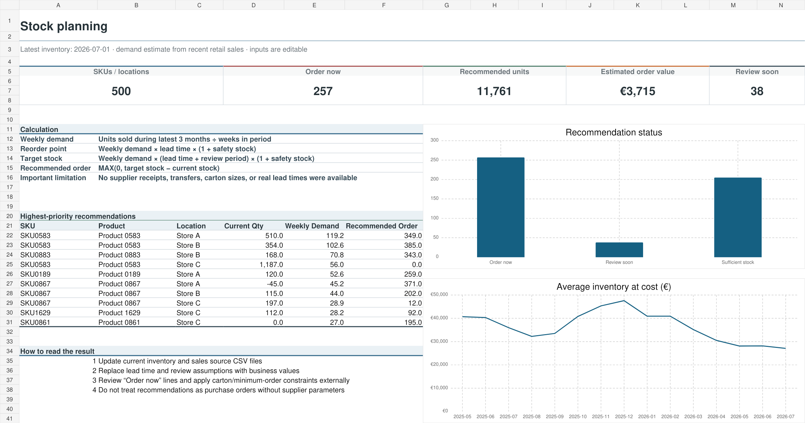

# Inventory forecast in Excel

This model started from a simple operational problem: checking hundreds of product balances manually takes too long, especially when the same product behaves differently in each store.

I combined recent retail demand with the latest stock snapshot and calculated a review status for each product–store combination.



## Files

- `analysis/inventory_forecast.xlsx` — dashboard, assumptions and 500 priority rows
- `data/inventory_monthly_sample.csv` — anonymized monthly inventory sample
- `data/forecast_inputs.csv` — product–store input table used by the review model

## Calculation

```text
Weekly demand = units sold in the recent period / number of weeks
Reorder point = weekly demand × lead time × (1 + safety stock)
Target stock = weekly demand × (lead time + review period) × (1 + safety stock)
Recommended order = MAX(0, target stock − current stock)
```

The default inputs are three months of demand, two weeks of lead time, a four-week review period and 20% safety stock. They can all be changed on the `Assumptions` sheet.

## Cleaning decision

The inventory exports contained 5,475 repeated rows caused by alternative supplier records. Their quantities were identical, so I kept one analytical row instead of summing them. This prevented an inventory overstatement of about 9%.

## Limitation

The source does not include supplier receipts, transfers, write-offs, carton quantities, minimum orders or real lead times. For that reason, the model produces a list for review, not a final purchase order.

The Excel model was calculated from the full cleaned history. The repository contains a 5,000-row history sample covering every month and location.
