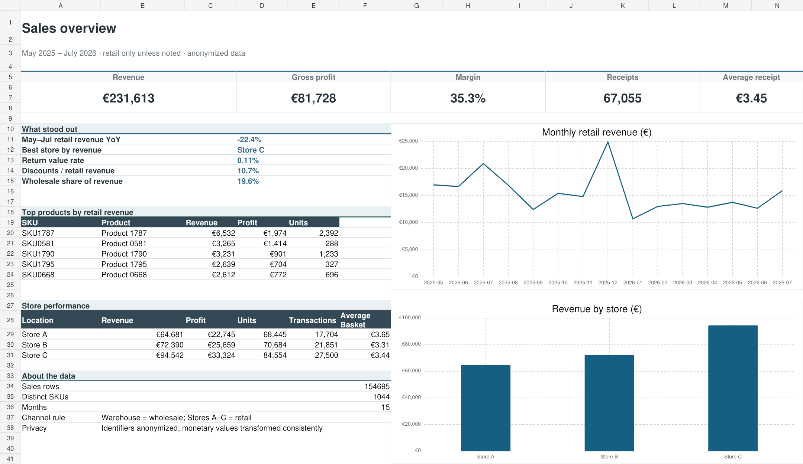

# Retail sales analysis: PostgreSQL + Excel

I built this project from 15 monthly sales exports. My aim was to answer practical questions I regularly face when working with retail reports: which store is growing, where margin changes, which products matter most, and whether discounts or returns are affecting the result.

## Data

- 154,695 sales lines in the full analysis
- 5,000 anonymized sample lines published in this repository
- 67,217 anonymized receipts and invoices
- 1,044 sold SKUs
- May 2025 to July 2026
- three retail stores and one wholesale warehouse

I analyzed the warehouse separately. It has few transactions but very high invoice values, so mixing it with the stores makes the average receipt and store comparisons misleading.

## Files

- `data/sales_transactions_sample.csv` — anonymized review sample
- `data/product_segments.csv` — ABC/XYZ result by product
- `sql/schema.sql` — PostgreSQL table
- `sql/queries.sql` — 12 analysis queries
- `analysis/sales_analysis.xlsx` — the same case presented in Excel

## What I checked

- monthly revenue, profit and margin;
- store and category performance;
- top products and revenue concentration;
- average and median receipt;
- discounts and returns;
- year-over-year change for comparable months;
- ABC/XYZ product segments.

## Result

Retail revenue for May–July 2026 was 22.4% below the same period in 2025. Full-period gross margin was 35.3%, and Store C generated 40.8% of retail revenue. December was the strongest month, while returns remained low at 0.11% of positive revenue.

## Cleaning notes

I standardized dates and product codes, removed employee and customer fields, anonymized business identifiers and kept negative return rows. Published monetary values were transformed by one constant factor, so trends and ratios are preserved.

The workbook and findings use the full cleaned dataset. The published sample retains every month, location and channel so the SQL workflow can be reproduced without sharing the complete operational export.
